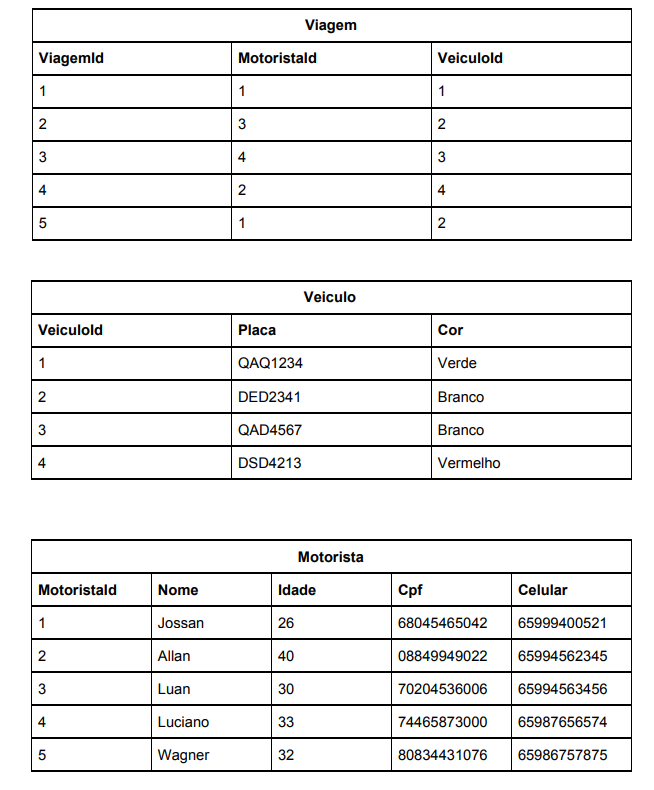

A. Faça uma consulta em sql que retorne somente a placa do veículo, nome, cpf e
idade do motorista utilizado na viagem com id 2.
B. Faça uma consulta em sql que retorne somente o nome e o cpf dos motoristas
utilizados em todas as viagens ordenado pelo nome.
C. Faça uma consulta em sql que retorne somente o nome dos motoristas que
realizaram viagens em veículos de cor iniciada em “V”
As queries devem ser escritas no PADRÃO ANSI SQL.
